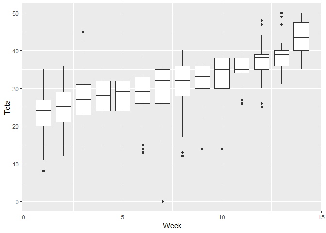

Strictly Hypothesis Testing
================
Doug Ashton
25/11/2018

I’ll get straight to it. I love
[Strictly](https://www.bbc.co.uk/strictly). You may know it by “Dancing
with the Stars”, “Bailando por un Sueño”, or “Danse avec les stars”. I
resisted for a decade, but for the last two years I’ve been fully
seduced by the big glitter ball and haven’t missed an episode.

Now as a fully qualified arm-chair critic, I think I’ve noticed that to
get a good score on Strictly you just need to do the Charleston. It
hides a multitude of sins. You sort of jump about a bit, do something
called “swivel”, and fall over at the end. Then you get a minimum 35.
Job done.

My family disagree, so I’ve set about to test my hypothesis. The great
news is that this is really easy to do with R. In fact, this whole post
uses no more R than you’d find in an [introduction to R
course](https://www.mango-solutions.com/additional-solutions/r-training).
My family can’t wait to find out the results. Wherever they went.

For the rest of this post you can relive with me how I tested out my
idea and finally put this to rest. Base R has everything we need but
we’ll get there quicker with the
[tidyverse](https://www.tidyverse.org/).

``` r
library(tidyverse) # I've set message=FALSE everywhere
```

## The Data

We’re lucky that someone at
[www.ultimatestrictly.com](https://www.ultimatestrictly.com/) has been
keeping track of every dance that’s ever happened on strictly. And we’re
even luckier that they have made it available as a CSV download. It only
goes up to 2016 but that’s still 14 series so it should be enough.

With the URL all we need are a couple of tweaks to the default
`read_csv` to account properly for an unusual NA string and some sparse
columns that guess the data type incorrectly.

``` r
url <- "https://www.ultimatestrictly.com/s/SCD-Results-S14.csv"
raw_results <- read_csv(file = url, na = c("-"), guess_max = 10000)

head(raw_results) %>%
  knitr::kable() # pretty markdown tables
```

| Couple            | Dance       | Song               | Series | Week | Order | Craig | Arlene | Len | Bruno | Alesha | Darcey | Jennifer | Donny | Total |
| :---------------- | :---------- | :----------------- | -----: | ---: | ----: | ----: | -----: | --: | ----: | -----: | -----: | -------: | ----: | ----: |
| Natasha & Brendan | Cha cha cha | Chain Of Fools     |      1 |    1 |     1 |     5 |      7 |   8 |     7 |     NA |     NA |       NA |    NA |    27 |
| Lesley & Anton    | Waltz       | He Was Beautiful   |      1 |    1 |     2 |     6 |      8 |   8 |     7 |     NA |     NA |       NA |    NA |    29 |
| Chris & Hanna     | Cha cha cha | Lady Marmalade     |      1 |    1 |     3 |     4 |      4 |   7 |     4 |     NA |     NA |       NA |    NA |    19 |
| Jason & Kylie     | Waltz       | Three Times A Lady |      1 |    1 |     4 |     5 |      5 |   6 |     5 |     NA |     NA |       NA |    NA |    21 |
| Verona & Paul     | Cha cha cha | R.E.S.P.E.C.T      |      1 |    1 |     5 |     7 |      6 |   7 |     7 |     NA |     NA |       NA |    NA |    27 |
| Claire & John     | Waltz       | Unchained Melody   |      1 |    1 |     6 |     7 |      7 |   8 |     5 |     NA |     NA |       NA |    NA |    27 |

So you see we get every dance, for every week in every series, and
individual judges scores as well as the total score.

Let’s start with a little light cleaning. The formatting on the dances
is a bit inconsistent. For example we have `Cha cha cha` and `Cha Cha
Cha`. Most of it can be fixed by forcing the dance names to be a
consistent case. I like the look of title case so we’ll use stringr’s
`str_to_title`.

``` r
dances <- raw_results %>%
  mutate(Dance = str_to_title(Dance))

dances %>%
  select(Dance) %>%
  head() %>%
  knitr::kable()
```

| Dance       |
| :---------- |
| Cha Cha Cha |
| Waltz       |
| Cha Cha Cha |
| Waltz       |
| Cha Cha Cha |
| Waltz       |

My next step would usually be to
[gather](https://tidyr.tidyverse.org/reference/gather.html) this into a
tidy long data frame, maybe
[separate](https://tidyr.tidyverse.org/reference/separate.html) the
couples into celebrity and professional. But in this instance we only
want the Dance and the Total, so we’ll leave it like it is.

## Top Dances

I’d like to know which dances get the best `Total` score. We can do this
with a `group_by`, `summarise` combination.

``` r
dances %>%
  group_by(Dance) %>%
  summarise(MeanScore = mean(Total, na.rm = TRUE),
            Count = n()) %>%
  head(3)
```

    ## # A tibble: 3 x 3
    ##   Dance           MeanScore Count
    ##   <chr>               <dbl> <int>
    ## 1 American Smooth      31.6   102
    ## 2 Argentine Tango      35.7    43
    ## 3 Cha Cha              32       1

I’m removing anything with less than 10 scores because these tend to be
hybrid dances and one-offs.

``` r
  filter(Count >= 10) %>%
```

The [Show Dance](http://www.ultimatestrictly.com/show-dance/) only
appears in the final episode and is multi-style. Out it goes.

``` r
 filter(Dance != "Show Dance") %>%
```

I don’t want any “hops” in there. The hops are those ones where
everyone’s on the floor at the same time and you have no idea what’s
going on but they all seem to be enjoying themselves. There’s only a
Lindy Hop in this data but I don’t want any hops. Ever. No Hops\!

``` r
  filter(!str_detect(Dance, " Hop")) %>%
```

Putting it all together we get our top dances.

``` r
top_dances <- dances %>%
  group_by(Dance) %>%
  summarise(MeanScore = mean(Total, na.rm = TRUE),
            Count = n()) %>%
  filter(Count >= 10)  %>%
  filter(Dance != "Show Dance") %>%
  filter(!str_detect(Dance, " Hop")) %>%
  arrange(desc(MeanScore))

knitr::kable(top_dances)
```

| Dance           | MeanScore | Count |
| :-------------- | --------: | ----: |
| Argentine Tango |  35.67442 |    43 |
| Viennese Waltz  |  32.10000 |    90 |
| Charleston      |  31.74324 |    74 |
| American Smooth |  31.57843 |   102 |
| Quickstep       |  30.71538 |   130 |
| Foxtrot         |  30.05738 |   122 |
| Samba           |  29.46296 |   108 |
| Paso Doble      |  29.21552 |   116 |
| Tango           |  28.89552 |   134 |
| Salsa           |  28.72549 |   102 |
| Jive            |  28.26016 |   123 |
| Rumba           |  28.17273 |   110 |
| Waltz           |  27.93233 |   133 |
| Cha Cha Cha     |  25.44805 |   154 |

And there we have it. I’m sort of right. The Charleston is top 3. And
who doesn’t like an Argentine Tango? But there’s something about that
count… What if they tend to only do the Charleston in later weeks when
they’re a bit better?

We know that the scores go up by week. In fact it’s pretty linear.

``` r
dances %>%
  ggplot(aes(x = Week, y = Total, group = Week)) + 
  geom_boxplot()
```

<!-- -->

Let’s do the same again and add average week.

``` r
top_dances_week <- dances %>%
  group_by(Dance) %>%
  summarise(MeanScore = mean(Total, na.rm = TRUE),
            MeanWeek = mean(Week, na.rm = TRUE),
            Count = n()) %>%
  filter(Count >= 10)  %>%
  filter(Dance != "Show Dance") %>%
  filter(!str_detect(Dance, " Hop")) %>%
  arrange(desc(MeanScore))

knitr::kable(head(top_dances_week, 5))
```

| Dance           | MeanScore |  MeanWeek | Count |
| :-------------- | --------: | --------: | ----: |
| Argentine Tango |  35.67442 | 10.023256 |    43 |
| Viennese Waltz  |  32.10000 |  6.911111 |    90 |
| Charleston      |  31.74324 |  6.891892 |    74 |
| American Smooth |  31.57843 |  7.333333 |   102 |
| Quickstep       |  30.71538 |  5.823077 |   130 |

Rats. My hypothesis is in trouble. My children have long since gone to
bed so let’s take it up a notch and build a statistical model that can
account for `Week` and `Dance` at the same time.

## Linear Model

First, we’ll take the individual dance level data and reuse the
filtering for the `top_dances`.

``` r
main_dances <- dances %>%
  filter(Dance %in% top_dances$Dance)
```

We want a simple linear model that accounts for the increasing score by
week and the effect we’re interested in – the dance.

``` r
fit <- lm(Total ~ Week + Dance, data = main_dances)
summary(fit)
```

    ## 
    ## Call:
    ## lm(formula = Total ~ Week + Dance, data = main_dances)
    ## 
    ## Residuals:
    ##      Min       1Q   Median       3Q      Max 
    ## -29.9515  -3.4593   0.4912   3.5637  19.4965 
    ## 
    ## Coefficients:
    ##                      Estimate Std. Error t value Pr(>|t|)    
    ## (Intercept)          23.37653    0.59660  39.183  < 2e-16 ***
    ## Week                  1.11844    0.04051  27.607  < 2e-16 ***
    ## DanceArgentine Tango  1.08747    0.95628   1.137  0.25564    
    ## DanceCha Cha Cha     -1.87934    0.68459  -2.745  0.00612 ** 
    ## DanceCharleston       0.65854    0.79808   0.825  0.40941    
    ## DanceFoxtrot          0.16272    0.70368   0.231  0.81716    
    ## DanceJive            -1.25416    0.70372  -1.782  0.07492 .  
    ## DancePaso Doble      -1.22840    0.71043  -1.729  0.08399 .  
    ## DanceQuickstep        0.82609    0.69385   1.191  0.23400    
    ## DanceRumba           -1.78227    0.72064  -2.473  0.01350 *  
    ## DanceSalsa           -1.36169    0.73365  -1.856  0.06364 .  
    ## DanceSamba           -1.83586    0.72150  -2.545  0.01104 *  
    ## DanceTango           -0.13999    0.69274  -0.202  0.83988    
    ## DanceViennese Waltz   0.99380    0.75585   1.315  0.18877    
    ## DanceWaltz           -0.03570    0.70003  -0.051  0.95934    
    ## ---
    ## Signif. codes:  0 '***' 0.001 '**' 0.01 '*' 0.05 '.' 0.1 ' ' 1
    ## 
    ## Residual standard error: 5.225 on 1526 degrees of freedom
    ## Multiple R-squared:  0.3969, Adjusted R-squared:  0.3914 
    ## F-statistic: 71.75 on 14 and 1526 DF,  p-value: < 2.2e-16

After removing the strong effect of week, there’s not much left of
significance. It can be tempting to cherry pick individual levels but
the only one with much signal is the Cha Cha Cha. Ultimate Strictly
describes it as [“A cheeky, fun dance, but rarely a show
stopper”](https://www.ultimatestrictly.com/cha-cha-cha/).

## Conclusion

Unfortunately it looks like the evidence doesn’t support my hypothesis
that the Charleston is more favourably marked. Maybe all that swivelling
is harder than it looks. Faye and Giovanni did undeniably do an
excellent job with their, perfect scoring, [Sound of Music
Charleston](https://youtu.be/55z6IrL8k0Q). What we did find is that the
Cha Cha Cha might score lower. Although that’s most likely because it’s
seen as an easier dance for. Well. People like
Quentin.

<iframe width="560" height="315" src="https://www.youtube.com/embed/Da_zxblfGoI?start=126" frameborder="0" allow="accelerometer; autoplay; encrypted-media; gyroscope; picture-in-picture" allowfullscreen>

</iframe>

I’m sorry Quentin. I would fare no better.

Well seeing as I’m wrong, and everyone else is asleep. Let’s just
pretend this never happened.

[Code for this blog post on
GitHub](https://github.com/mangothecat/blog_strictly).
